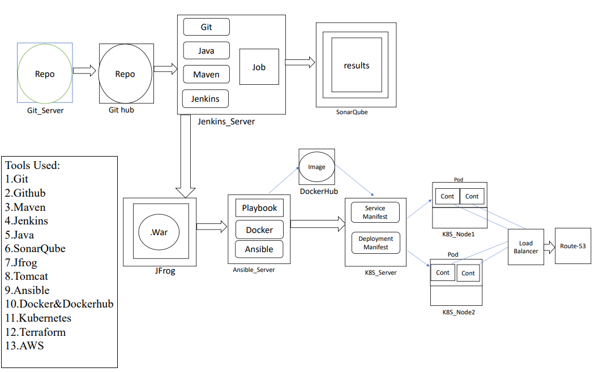

# End-to-End Automated DevOps CI/CD Pipeline

This repository contains all the automation scripts, pipeline configurations, and deployment manifests used to build, package, and deploy a web application across a multi-node AWS infrastructure.

The entire setup handles everything from source code extraction and security scanning down to automated container packaging and Kubernetes orchestration.

---

## System Architecture Diagram

---

## Infrastructure and Environment Breakdown

The underlying infrastructure consists of 5 independent EC2 instances provisioned via Terraform, working alongside a dedicated Kubernetes cluster node where commands are executed directly via kubectl:

- Git Server: Dedicated self-hosted Git node running tracking branch project.
- Jenkins Server: Central automation engine orchestrating build lifecycle stages.
- SonarQube Server: Code security and static analysis platform running inside a Docker container.
- JFrog Artifactory: Pinned repository manager (v7.38.10) hosting versioned application binaries.
- Ansible Master: Configuration controller handling local builds and triggering cluster playbooks.
- Kubernetes Control Machine: Standalone node configured with kubectl where cluster deployment and service manifests are applied directly to worker nodes.

---

## Repository File Structure

This repository is organized to allow Jenkins and Ansible to cleanly pull configuration paths from the absolute directory workspace:

- Jenkinsfile: The complete 5-stage continuous integration automation pipeline.
- Dockerfile: Custom server layer packaging the compiled binary package into Tomcat.
- push-image.yml: Ansible playbook automating Docker authentication and image pushes.
- k8s-deploy-playbook.yml: Ansible playbook deploying the application state to the cluster.
- k8s-service-playbook.yml: Ansible playbook exposing the application network services.
- deployment.yml: Declarative Kubernetes manifest managing 4 replica application pods.
- service.yml: Declarative Kubernetes manifest provisioning the public AWS LoadBalancer.

---

## Production Cluster Orchestration

The application cluster state scales dynamically to manage traffic routing and rolling upgrades with zero downtime.

- High-Availability Scaling: Deploys 4 identical runtime pod replicas across available cluster compute nodes via deployment.yml.
- Traffic Load Balancing: Configures network routing rules using a LoadBalancer service manifest to bind an internet-facing entry point.

Project Demonstration: [Watch the Full Deployment Automation Walkthrough Video](YOUR_LINKEDIN_VIDEO_URL)

---

## Pipeline Stage Verification and Dashboards

1. Static Application Security Testing (SAST)
The source code code quality gates are validated by SonarQube before any build artifacts are packaged.
[view SonarQube Code Analysis Quality Gate](./screenshots/1-sonarqube-quality-gate.png)

2. Continuous Integration Lifecycle Engine
Jenkins coordinates codebase pulls, triggers analysis steps, and handles downstream deployment handoffs automatically.
[view Jenkins Automation Orchestrator Pipeline](./screenshots/2-jenkins-pipeline-dashboard.png)

3. Binary Artifact Storage and Security
Compiled .war application binaries are assigned distinct version numbers and uploaded to an enterprise registry.
[view JFrog Artifactory Local Release Repository](./screenshots/3-jfrog-artifactory-storage.png)

4. Containerized Image Packaging
Production runtime code gets container layers wrapped and pushed straight to standard hosting systems.
[view Docker Hub Container Image Registry](./screenshots/4-dockerhub-registry.png)

5. Final Verified Production Deployment
The responsive user interface accessible directly by end-users via public routing.
[view Live Production Application Web Interface](./screenshots/5-production-web-app.png)
